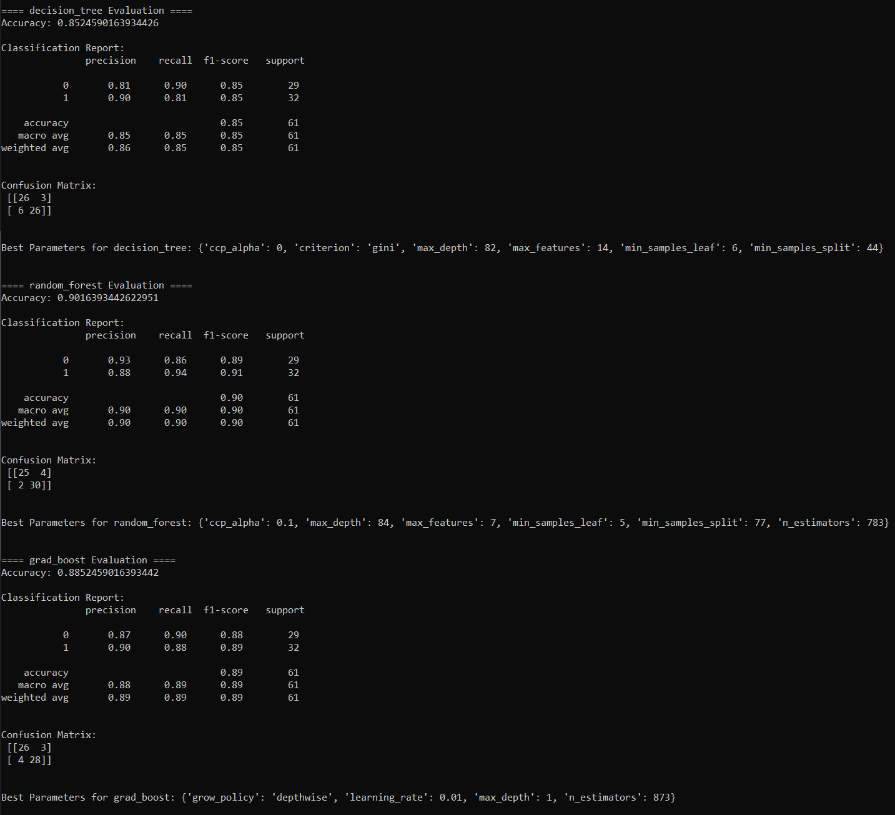

<h1 align="center" id="title">Heart Disease Deciscion Trees and Forests</h1>

<p id="description"><h2>Overview</h2>
<br>This project aims to predict the presence of heart disease in individuals using a data-driven approach. Leveraging the UCI Heart Disease dataset a well-known repository in medical dataset analysis the project explores and implements three distinct but complementary machine learning models: Decision Tree Random Forest and Gradient Boosting using XGBoost. These models are chosen for their efficacy in handling classification tasks and their ability to provide insights into feature importance and decision-making processes. 
<br>
<br>
<h2>Dataset</h2>

 The UCI Heart Disease dataset comprises clinical and demographic data points including age sex chest pain type resting blood pressure cholesterol levels fasting blood sugar and more. It's a classic dataset in medical analytics known for its mix of categorical and continuous variables and its relevance in predicting heart disease. 
<br>
<br>
<h2>Objectives</h2>

The primary objective is to build and compare models that can accurately predict the likelihood of heart disease in patients. The project focuses on the following aspects: 

- Data Preprocessing: Handling missing values encoding categorical variables and applying standardization techniques to prepare the dataset for analysis. 

- Class Imbalance Handling: Using SMOTE (Synthetic Minority Over-sampling Technique) to address class imbalance in the dataset which is a common issue in medical datasets. 

- Model Training and Hyperparameter Tuning: Developing a Decision Tree Random Forest and Gradient Boosting models using XGBoost each followed by meticulous hyperparameter tuning to optimize performance. 

- Model Evaluation: Comparing the models based on accuracy precision recall and F1-score to determine their effectiveness in predicting heart disease. 

- Feature Importance Analysis: Interpreting the models to understand which features most significantly influence the prediction of heart disease providing valuable insights for medical professionals. 
<br>
<br>
<h2>Technical Approach</h2>
The project employs Python a popular language in data science and utilizes libraries such as Scikit-learn for model development Pandas for data handling and XGBoost for the gradient boosting model. The approach is methodical starting from exploratory data analysis moving through model development and tuning and concluding with a comprehensive evaluation of each model. 
<br>
<br>
<h2>Significance</h2>
 Predicting heart disease is a vital task in healthcare and this project aims to contribute to this field by applying machine learning techniques. By comparing different models the project seeks to provide a nuanced understanding of how various algorithms perform on medical datasets and how they can be used in real-world diagnostic processes. 
<br>
<br>
<h2>Conclusion</h2> 
The Heart Disease Prediction Project stands as a testament to the power of machine learning in transforming healthcare analytics. It combines robust data processing techniques advanced machine learning models and thorough performance evaluation to create a comprehensive approach to disease prediction.</p>

<h2>🛠️ Installation Steps:</h2>

<p>1. Install the required packages using the requirements.txt file</p>

```
pip install -r requirements.txt
```

<p>2. Run main() for training by giving it a number of total runs</p>

```
main(totalRuns=3)
```

<p>3. If you are wanting to load a model just add the filename to the models array and run main()</p>

```
main("filename")
```

<h2>Trained models</h2>
There are three trained models that are the best that I could do with their console output below with the parameters.

